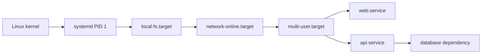
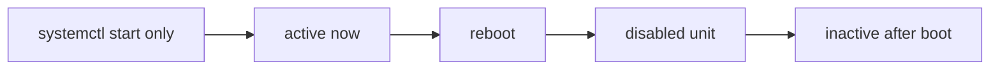
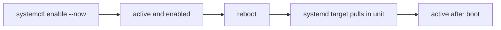
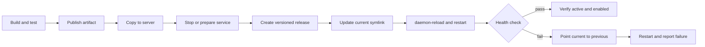
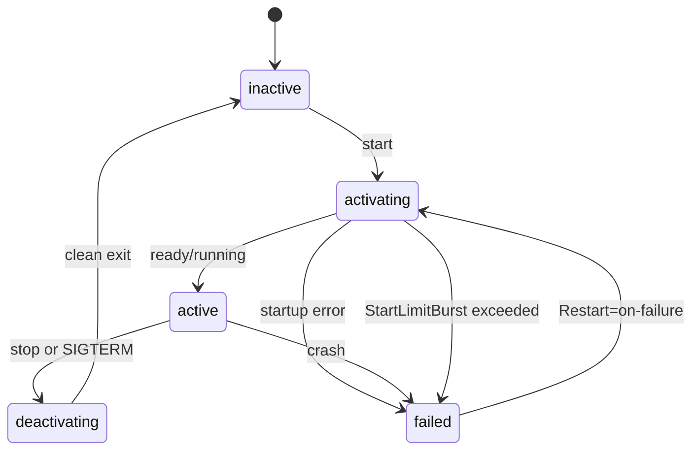

# The Reboot That Took Us Down: Mastering systemd Services in Production

**Meta description:** Run Linux applications reliably with systemd: units, logs, timers, releases, rollback, hardening, and incident lessons.

**Keywords:** systemd production, Linux service deployment, systemctl, journalctl, systemd timers

**URL slug:** `the-reboot-that-took-us-down-systemd-production`

**Suggested hero image:** A dark Linux terminal with an orange systemd dependency graph overlay.

**Illustration ideas:**

1. **Boot dependency graph:** kernel, PID 1, targets, and application services on a dark background with orange edges. Alt text: "Linux boot flow from the kernel to systemd targets and application services."
2. **Unit file anatomy:** a terminal-style service file with `[Unit]`, `[Service]`, and `[Install]` highlighted. Alt text: "Annotated systemd service unit showing dependency, process, and boot-installation sections."
3. **Release path:** immutable release directories, a `current` symlink, and a systemd restart with health-check and rollback branches. Alt text: "Systemd deployment flow using versioned releases, a current symlink, health check, and rollback."

## 1. Introduction

When I run an application directly on a Linux VM, systemd is the boundary between a process and a service. It starts the process at boot, restarts it when it fails, captures logs, and gives me one consistent operations interface.

Without it, an application is just a shell command in someone's terminal until SSH disconnects, the host reboots, or the process crashes.

This is also where I learned a painful lesson: `systemctl start` changes the current state, but it does not make a service start at the next boot. In the incident later, a service was active before maintenance and missing after reboot because nobody had run `systemctl enable`.

This targets applications on EC2, on-premises VMs, and similar Linux hosts.

> **Key takeaways**
>
> - Treat systemd as part of your application runtime, not as an OS detail.
> - `start` affects now; `enable` affects future boots.
> - Put service definitions and deployment scripts in Git.

## 2. What systemd does

systemd runs as PID 1, the first userspace process started by the kernel. It brings the host to a target state, starts units in dependency order, supervises long-running processes, and records service output in the journal.

A unit is a resource systemd knows how to manage:

| Unit      | Purpose                                    | Example             |
| --------- | ------------------------------------------ | ------------------- |
| `service` | A long-running process or one-shot command | `api.service`       |
| `timer`   | Schedules another unit                     | `backup.timer`      |
| `socket`  | Opens a socket and activates a service     | `sshd.socket`       |
| `target`  | Groups units into a desired state          | `multi-user.target` |
| `mount`   | Describes a filesystem mount               | `data.mount`        |

The boot path is dependency-driven:



> **Key takeaways**
>
> - systemd combines boot orchestration, supervision, logs, dependencies, and limits.
> - Unit types describe different operating-system resources.
> - Ordering and dependency are related but different concepts.

## 3. `systemctl` essentials

I start with `systemctl status`, then move to the narrower action I need.

| Command                                    | What it does                  | When to use it                      |
| ------------------------------------------ | ----------------------------- | ----------------------------------- |
| `sudo systemctl start app.service`         | Starts now                    | First manual start                  |
| `sudo systemctl stop app.service`          | Stops now                     | Maintenance or rollback             |
| `sudo systemctl restart app.service`       | Stops and starts              | Deploying a new process             |
| `sudo systemctl reload app.service`        | Asks the process to reload    | Config changes supported by the app |
| `systemctl status app.service`             | Shows state and recent output | First diagnostic check              |
| `sudo systemctl enable app.service`        | Enables boot-time start       | After installing a service          |
| `sudo systemctl disable app.service`       | Removes boot-time start       | Decommissioning                     |
| `sudo systemctl enable --now app.service`  | Enables and starts            | Normal first activation             |
| `systemctl is-enabled app.service`         | Reports boot configuration    | CI or provisioning assertion        |
| `systemctl is-active app.service`          | Reports current runtime state | Health check                        |
| `sudo systemctl daemon-reload`             | Reloads unit definitions      | After editing or adding a unit      |
| `sudo systemctl mask app.service`          | Makes starts impossible       | Emergency quarantine                |
| `sudo systemctl unmask app.service`        | Removes the mask              | Restoring normal control            |
| `systemctl list-units --type=service`      | Lists loaded service units    | Inventory                           |
| `systemctl list-unit-files --type=service` | Lists installed unit files    | Find enabled/disabled state         |
| `systemctl list-dependencies app.service`  | Shows dependency tree         | Ordering and startup debugging      |

The distinction I check during every deployment is simple:

```bash
systemctl is-active my-api.service   # Is the process active now?
systemctl is-enabled my-api.service  # Will systemd start it at boot?
```

> **Key takeaways**
>
> - Use `enable --now` for the first production activation.
> - Run `daemon-reload` after changing a unit file, before restarting.
> - Never infer boot behavior from the current active state.

## 4. `journalctl` essentials

A unit's stdout and stderr normally land in journald. That gives me a single place to inspect application startup without guessing which log file a framework chose.

```bash
# Recent logs for one service
sudo journalctl -u my-api.service --no-pager -n 100

# Follow logs while reproducing a problem
sudo journalctl -fu my-api.service

# Logs from a time window
sudo journalctl -u my-api.service --since "2026-09-29 09:00" --until "2026-09-29 10:00"

# Errors in the current boot and the previous boot
sudo journalctl -p err -b --no-pager
sudo journalctl -u my-api.service -b -1 --no-pager

# Machine-readable output for a log pipeline
sudo journalctl -u my-api.service -n 20 -o json-pretty

# Journal disk use and time-based cleanup
sudo journalctl --disk-usage
sudo journalctl --vacuum-time=14d
```

For logs to survive a reboot, create `/var/log/journal`:

```bash
sudo mkdir -p /var/log/journal
sudo systemctl restart systemd-journald
```

Configure retention in `/etc/systemd/journald.conf`:

```ini
[Journal]
Storage=persistent
SystemMaxUse=2G
MaxRetentionSec=14day
```

Apply it with `sudo systemctl restart systemd-journald`. Choose limits that fit the disk and compliance requirements.

```bash
systemctl status my-api.service --no-pager
sudo journalctl -u my-api.service -b --no-pager -n 100
sudoedit /etc/systemd/system/my-api.service
sudo systemctl daemon-reload
sudo systemctl restart my-api.service
sudo journalctl -u my-api.service -f
```

**[screenshot: `systemctl status` output showing Loaded, Active, Main PID, and recent logs]**

> **Key takeaways**
>
> - Start with unit-scoped logs: `journalctl -u name.service`.
> - Use `-b -1` when a reboot may explain the failure.
> - Set journal retention deliberately and monitor disk use.

## 5. Anatomy of a service unit

A unit file at `/etc/systemd/system/my-api.service` usually has three sections:

| Section     | Responsibility            | Common directives                           |
| ----------- | ------------------------- | ------------------------------------------- |
| `[Unit]`    | Identity and dependencies | `Description`, `After`, `Wants`, `Requires` |
| `[Service]` | Process and lifecycle     | `ExecStart`, `User`, `Restart`, limits      |
| `[Install]` | Enablement relationship   | `WantedBy`                                  |

Here is a production-shaped example:

```ini
[Unit]
Description=My API
After=network-online.target
Wants=network-online.target

[Service]
Type=simple
User=my-api
Group=my-api
WorkingDirectory=/opt/my-api/current
EnvironmentFile=/etc/my-api/my-api.env
ExecStart=/usr/bin/node /opt/my-api/current/dist/server.js
Restart=on-failure
RestartSec=5s
StartLimitIntervalSec=60s
StartLimitBurst=5
TimeoutStopSec=30s
NoNewPrivileges=true
ProtectSystem=strict
PrivateTmp=true
ReadWritePaths=/opt/my-api/shared
LimitNOFILE=65536
MemoryMax=512M

[Install]
WantedBy=multi-user.target
```

`After` orders startup, while `Wants` adds a related unit. `Type=simple` considers the service started once the process is launched. `ExecStart` is the exact executable; use absolute paths. `WorkingDirectory` controls relative paths.

`User` and `Group` avoid running code as root. `EnvironmentFile` keeps deployment configuration out of the unit and should be mode `0640` or stricter. `Restart=on-failure` handles crashes without restarting a clean administrative stop. `StartLimit*` prevents endless restart loops.

`NoNewPrivileges`, `ProtectSystem`, and `PrivateTmp` reduce the process's ability to alter the host. Test `ProtectSystem=strict` because it makes most of the filesystem read-only. `ReadWritePaths` opens only directories the app needs. `MemoryMax` and `LimitNOFILE` make resource assumptions explicit.

```text
/etc/systemd/system/my-api.service
|-- [Unit]      -> when this unit is ordered and what it wants
|-- [Service]   -> which process runs, as whom, and how it recovers
`-- [Install]   -> which target pulls it in at boot
```

Validate before activation:

```bash
sudo systemd-analyze verify /etc/systemd/system/my-api.service
sudo systemctl daemon-reload
sudo systemctl enable --now my-api.service
```

> **Key takeaways**
>
> - Make the executable, user, working directory, environment, and restart policy explicit.
> - Harden incrementally and test permissions with the real application.
> - `systemd-analyze verify` catches many unit-file mistakes before runtime.

## 6. Real-world service units

### React, Vue, Angular, or Vite static build

My preferred production path for a static frontend is to build once and let Nginx serve the files:

```bash
npm ci
npm run build
sudo systemctl enable --now nginx.service
sudo systemctl is-active nginx.service
```

For a Node-based SSR frontend such as Next.js, use a dedicated service:

```ini
[Unit]
Description=Frontend SSR application
After=network-online.target
Wants=network-online.target

[Service]
Type=simple
User=frontend
Group=frontend
WorkingDirectory=/opt/frontend/current
EnvironmentFile=/etc/frontend/frontend.env
ExecStart=/usr/bin/npm start
Restart=on-failure
RestartSec=5s
TimeoutStopSec=30s

[Install]
WantedBy=multi-user.target
```

Without Nginx, a static build can use `serve`:

```ini
[Service]
Type=simple
User=frontend
WorkingDirectory=/opt/frontend/current
ExecStart=/usr/bin/npx --no-install serve -s build -l 3000
Restart=on-failure
```

Pin `serve` in the project and use an absolute binary path in a stable deployment.

### Node.js backend and template instances

```ini
[Unit]
Description=Orders API instance %i
After=network-online.target
Wants=network-online.target

[Service]
Type=simple
User=orders
Group=orders
WorkingDirectory=/opt/orders/%i/current
EnvironmentFile=/etc/orders/%i.env
ExecStart=/usr/bin/node dist/server.js
Restart=on-failure
RestartSec=3s
TimeoutStopSec=30s

[Install]
WantedBy=multi-user.target
```

Save it as `/etc/systemd/system/orders@.service`; run instances with separate ports and environment files:

```bash
sudo systemctl daemon-reload
sudo systemctl enable --now orders@blue.service orders@green.service
systemctl status orders@blue.service --no-pager
```

### .NET and Kestrel

For systemd notification support, add `Microsoft.Extensions.Hosting.Systemd` and call `.UseSystemd()` in the host builder. Then use `Type=notify`:

```ini
[Unit]
Description=Catalog ASP.NET Core API
After=network-online.target
Wants=network-online.target

[Service]
Type=notify
User=catalog
Group=catalog
WorkingDirectory=/opt/catalog/current
Environment=DOTNET_ENVIRONMENT=Production
Environment=ASPNETCORE_URLS=http://127.0.0.1:5000
ExecStart=/usr/bin/dotnet /opt/catalog/current/Catalog.Api.dll
Restart=on-failure
RestartSec=5s
TimeoutStopSec=30s

[Install]
WantedBy=multi-user.target
```

### Spring Boot

```ini
[Unit]
Description=Payments Spring Boot API
After=network-online.target
Wants=network-online.target

[Service]
Type=simple
User=payments
Group=payments
WorkingDirectory=/opt/payments/current
EnvironmentFile=/etc/payments/payments.env
ExecStart=/usr/bin/java -Xms256m -Xmx768m -XX:+ExitOnOutOfMemoryError -jar /opt/payments/current/payments.jar
SuccessExitStatus=143
Restart=on-failure
RestartSec=10s
TimeoutStopSec=45s

[Install]
WantedBy=multi-user.target
```

| App             | Type/ExecStart                 | Restart      | Graceful shutdown     | Common pitfall                          |
| --------------- | ------------------------------ | ------------ | --------------------- | --------------------------------------- |
| Static frontend | Nginx unit serving `dist`      | Nginx policy | Nginx reload          | Serving a dev server in production      |
| SSR frontend    | `simple`, `npm start`          | `on-failure` | Node receives SIGTERM | Shell PATH differs from SSH PATH        |
| Node backend    | `simple`, absolute `node` path | `on-failure` | App handles SIGTERM   | Missing `EnvironmentFile` or port clash |
| .NET backend    | `notify`, `dotnet app.dll`     | `on-failure` | Host shutdown hooks   | Missing `.UseSystemd()` with `notify`   |
| Spring Boot     | `simple`, `java -jar`          | `on-failure` | JVM shutdown hook     | Heap ignores host memory budget         |

> **Key takeaways**
>
> - Static frontends belong behind a real web server; SSR apps need their own unit.
> - Use dedicated accounts and absolute executable paths.
> - Match `Type` to the runtime's actual readiness behavior.

## 7. Timers instead of cron

A timer is a systemd unit that activates a service. Compared with cron, timers provide journal integration, dependency handling, missed-run persistence, and the same operational commands as every other unit. Cron remains simpler for a single-user task and is widely understood.

Nightly cleanup example:

```ini
# /etc/systemd/system/app-log-cleanup.service
[Unit]
Description=Clean old application logs

[Service]
Type=oneshot
User=root
ExecStart=/usr/bin/find /var/log/my-api -type f -name '*.log' -mtime +14 -delete
```

```ini
# /etc/systemd/system/app-log-cleanup.timer
[Unit]
Description=Nightly application log cleanup

[Timer]
OnCalendar=*-*-* 02:30:00
Persistent=true
RandomizedDelaySec=15m

[Install]
WantedBy=timers.target
```

`Persistent=true` runs the missed activation after the host returns. `RandomizedDelaySec` avoids many hosts doing the same work simultaneously. Other useful schedules include `OnBootSec=15min` and `OnUnitActiveSec=1h`.

```bash
sudo systemd-analyze calendar '*-*-* 02:30:00'
sudo systemctl daemon-reload
sudo systemctl enable --now app-log-cleanup.timer
systemctl list-timers --all
sudo systemctl start app-log-cleanup.service
sudo journalctl -u app-log-cleanup.service --no-pager
```

> **Key takeaways**
>
> - Pair a timer with a service; keep the work in the service.
> - Use `Persistent=true` for work that must not be silently skipped.
> - Test calendar expressions before enabling them.

## 8. Incident: the reboot that caused downtime

This is a blameless template.

**Date/environment:** [date, environment]

**Service affected:** [service name and stack]

**What happened:** The server was rebooted for [patching/AWS maintenance/manual maintenance]. The service had previously been started with `systemctl start`, but it had never been enabled. After the reboot, systemd did exactly what it was configured to do: it did not start the disabled service.

**Impact:** [duration]. [Users/services] were affected.

**Detection:** [alert, user report, synthetic check, or dashboard].

| Time    | Event                                                               |
| ------- | ------------------------------------------------------------------- |
| [HH:MM] | Host reboot initiated for [reason].                                 |
| [HH:MM] | Host returns; service remains inactive because it is disabled.      |
| [HH:MM] | [Alert or user report] detects the outage.                          |
| [HH:MM] | Engineer confirms `is-active` and checks the previous boot journal. |
| [HH:MM] | `enable --now` restores the service.                                |
| [HH:MM] | Health check and logs confirm recovery.                             |

**Root cause:** The service was active before reboot but not enabled for boot. The operational procedure verified the present state and omitted the persistent state.

**Resolution:**

```bash
sudo systemctl enable --now [service-name].service
systemctl is-enabled [service-name].service
systemctl is-active [service-name].service
sudo journalctl -u [service-name].service -b --no-pager
curl --fail http://127.0.0.1:[port]/health
```

Before the fix, the state transition looked like this:



After the fix:



**Prevention:** Provision with `enable --now`; make CI/CD assert `is-enabled`; reboot-test in staging; monitor service-down and endpoint health; use `Restart=on-failure`; and manage units through configuration management.

**[screenshot: `systemctl is-enabled`, `is-active`, and `journalctl -b` after recovery]**

> **Key takeaways**
>
> - A reboot is a persistence test, not just a restart test.
> - Record both runtime and boot state in post-deploy checks.
> - The fix is small, but the control should be automated.

## 9. systemd in a CI/CD release pipeline



A server layout:

```text
/opt/orders/
|-- releases/2026-09-29.1200/
|-- releases/2026-09-28.1800/
|-- current -> releases/2026-09-29.1200
`-- shared/
```

GitHub Actions can invoke a checked-in deployment script:

```yaml
- name: Deploy to VM
  env:
    RELEASE: ${{ github.sha }}
  run: |
    scp -r dist deploy@${{ secrets.APP_HOST }}:/tmp/orders-${RELEASE}
    ssh deploy@${{ secrets.APP_HOST }} \
      "RELEASE=${RELEASE} /opt/deploy/deploy-orders.sh /tmp/orders-${RELEASE}"
```

The script should fail closed and retain the previous release:

```bash
#!/usr/bin/env bash
set -Eeuo pipefail

new_release=${1:?release directory is required}
app_root=/opt/orders
service=orders.service
health_url=http://127.0.0.1:8080/health
previous_release=$(readlink -f "$app_root/current" || true)

install -d -o orders -g orders "$app_root/releases"
release_name=$(basename "$new_release")
mv "$new_release" "$app_root/releases/$release_name"
chown -R orders:orders "$app_root/releases/$release_name"
ln -sfn "$app_root/releases/$release_name" "$app_root/current"

sudo systemctl daemon-reload
sudo systemctl restart "$service"

if ! curl --silent --show-error --fail --max-time 10 "$health_url" >/dev/null; then
  ln -sfn "$previous_release" "$app_root/current"
  sudo systemctl restart "$service"
  echo "Deployment failed; rolled back to $previous_release" >&2
  exit 1
fi

systemctl is-active --quiet "$service"
systemctl is-enabled --quiet "$service"
sudo journalctl -u "$service" --since "2 minutes ago" --no-pager
```

Use narrowly scoped sudo permissions. Verify:

```bash
systemctl is-active orders.service
systemctl is-enabled orders.service
sudo journalctl -u orders.service --since "10 minutes ago" --no-pager
curl --fail https://app.example.com/health
```

> **Key takeaways**
>
> - Deploy immutable, versioned directories and move one symlink.
> - Health-check the new process before declaring success.
> - Rollback should be a normal, tested path.

## 10. Managing the application lifecycle

A clean stop sends SIGTERM. The application should stop accepting work, finish requests, close connections, and exit before `TimeoutStopSec` expires.

The lifecycle is:



Use `ExecStartPre` for cheap, local preconditions, not a replacement for endpoint health checks:

```ini
[Unit]
Description=API with startup checks
After=network-online.target postgresql.service
Wants=network-online.target
Requires=postgresql.service

[Service]
User=api
WorkingDirectory=/opt/api/current
ExecStartPre=/usr/bin/test -r /opt/api/current/dist/server.js
ExecStartPre=/usr/bin/test -r /etc/api/api.env
EnvironmentFile=/etc/api/api.env
ExecStart=/usr/bin/node dist/server.js
ExecReload=/bin/kill -HUP $MAINPID
Restart=on-failure
RestartSec=5s
StartLimitIntervalSec=60s
StartLimitBurst=5
CPUQuota=150%
MemoryMax=768M
TimeoutStopSec=30s

[Install]
WantedBy=multi-user.target
```

When `StartLimitBurst` trips, inspect the journal, fix the cause, then run `sudo systemctl reset-failed api.service` before restarting.

> **Key takeaways**
>
> - Graceful shutdown is an application responsibility supported by systemd.
> - Dependencies should express real startup requirements.
> - Resource limits and start-rate limits turn failure modes into visible, bounded states.

## 11. Troubleshooting cheat sheet

| Symptom                            | Likely cause                                    | Command to check                                                          |
| ---------------------------------- | ----------------------------------------------- | ------------------------------------------------------------------------- |
| Exit code `203/EXEC`               | Bad path, missing executable, or permissions    | `systemctl status app; command -v node`                                   |
| Permission denied                  | Wrong `User`, file mode, or directory traversal | `sudo -u app test -r /path/file`                                          |
| Port in use                        | Old process or another unit owns the port       | `sudo ss -ltnp 'sport = :8080'`                                           |
| Environment missing                | Wrong/missing `EnvironmentFile`                 | `sudo systemctl show app -p EnvironmentFiles`                             |
| `start-limit-hit`                  | Repeated startup failures                       | `journalctl -u app -b; systemctl reset-failed app`                        |
| Not starting on boot               | Unit is disabled or not wanted by target        | `systemctl is-enabled app; systemctl list-dependencies multi-user.target` |
| Changes ignored                    | Unit cache was not reloaded                     | `sudo systemctl daemon-reload`                                            |
| Starts manually but not in systemd | Different PATH, cwd, user, or env               | `systemctl cat app; systemctl show app`                                   |

For an unknown failure, collect a bounded diagnostic bundle:

```bash
systemctl status app.service --no-pager
systemctl cat app.service
systemctl show app.service -p User -p WorkingDirectory -p ExecStart -p EnvironmentFiles
sudo journalctl -u app.service -b --no-pager -n 200
```

## 12. Best-practices checklist

- [x] Run each application as a dedicated non-root user.
- [x] Put secrets and environment-specific values in a protected `EnvironmentFile` or secret manager.
- [ ] Use `sudo systemctl enable --now` for first activation.
- [ ] Prefer `Restart=on-failure` and set a sensible restart delay.
- [ ] Set `TimeoutStopSec` after testing graceful shutdown.
- [ ] Enable persistent journaling and monitor journal disk use.
- [ ] Run `systemd-analyze verify` in CI.
- [ ] Version unit files, environment templates, and deploy scripts in Git.
- [ ] Test reboot behavior in staging.
- [ ] Assert both `is-active` and `is-enabled` after deployment.
- [ ] Keep a tested rollback release available.

## 13. Conclusion

systemd gives a VM-hosted application the lifecycle controls I expect from a production platform: deterministic startup, supervised processes, structured logs, dependency ordering, resource boundaries, and recoverable releases.

The operational lesson is easy to miss because the command is easy to type: starting a service is not enabling it. Check both states, automate the check, and test the reboot before production does it for you.

Related posts: [the systemd decommissioning incident](systemd-decommission-fix.html), [the Nginx 502 investigation](nginx-502-fix.html), and [writing postmortems that drive change](writing-postmortems-that-drive-real-change.html).

## Downloadable systemd cheat sheet

| Goal                   | Command                                                       |
| ---------------------- | ------------------------------------------------------------- |
| Validate a unit        | `sudo systemd-analyze verify /etc/systemd/system/app.service` |
| Start and enable       | `sudo systemctl enable --now app.service`                     |
| Inspect current state  | `systemctl status app.service --no-pager`                     |
| Inspect boot state     | `systemctl is-enabled app.service`                            |
| Inspect logs           | `sudo journalctl -u app.service -b --no-pager -n 100`         |
| Reload definitions     | `sudo systemctl daemon-reload`                                |
| Test a timer           | `sudo systemd-analyze calendar '*-*-* 02:30:00'`              |
| Reset crash-loop limit | `sudo systemctl reset-failed app.service`                     |
| Check a port           | `sudo ss -ltnp 'sport = :8080'`                               |

## Suggested GitHub repository structure

```text
systemd-app-ops/
|-- units/
|   |-- my-api.service
|   |-- orders@.service
|   |-- app-log-cleanup.service
|   `-- app-log-cleanup.timer
|-- env/
|   `-- my-api.env.example
|-- deploy/
|   `-- deploy-orders.sh
|-- scripts/
|   `-- verify-systemd.sh
`-- README.md
```

## FAQ

### Why did my service not start after reboot?

It was probably started but not enabled. Check `systemctl is-enabled app.service`, then use `sudo systemctl enable --now app.service` if boot activation is intended.

### Should I use systemd, PM2, or Docker?

Use systemd as the host-level supervisor for ordinary Linux services. PM2 adds Node-specific features; Docker packages the runtime, but still needs a host or orchestrator lifecycle.

### Should I use `Restart=always`?

Usually no. `Restart=on-failure` distinguishes a crash from an intentional stop. Use `always` only when a clean exit should also cause immediate relaunch and that behavior is deliberate.

### Why does `daemon-reload` not restart my application?

It only makes systemd reread unit definitions. You still need `systemctl restart app.service` or another lifecycle action.

### Where should production secrets go?

Use a protected environment file or managed secret store. Never put credentials in Git or visible shell commands.

## LinkedIn post draft

A service can be healthy before a reboot and still fail after it.

I wrote a practical guide to systemd for teams running apps directly on Linux VMs: service units, journald, timers, hardening, Node/.NET/Spring examples, versioned releases, rollback, and the incident caused by using `systemctl start` without `enable`.

The key check is simple:

`systemctl is-active app.service`
`systemctl is-enabled app.service`

Both states matter. Read the full InfraByFrancis guide: [URL]
