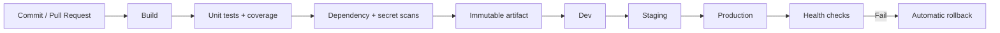
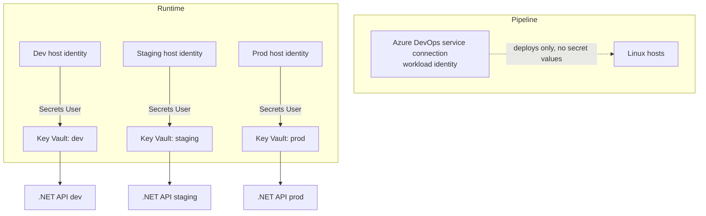
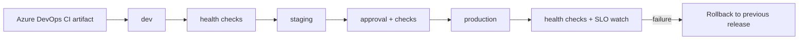

# Task

Update the blog post `blog/azure-devops-cicd-dotnet-react-key-vault.html` with the revised content below.

# Context

- Site: infrabyfrancis.me (personal SRE/tech blog, static HTML).
- Author: Francis Morkeh Mensah.
- Existing post URL: https://infrabyfrancis.me/blog/azure-devops-cicd-dotnet-react-key-vault
- Canonical: https://infrabyfrancis.me/blog/azure-devops-cicd-dotnet-react-key-vault.html
- Sister post: https://infrabyfrancis.me/blog/the-reboot-that-took-us-down-systemd-production (link to it where the content says so).

# Rules

1. Reuse the existing post's HTML template, CSS classes, header, footer, author card, theme toggle, figure markup, and Mermaid rendering. Do not create a new layout.
2. Convert the Markdown between `<<<POST_START>>>` and `<<<POST_END>>>` into HTML matching the existing structure (h1, h2, h3, lists, code blocks, figures with captions).
3. Keep all code blocks verbatim. Do not reformat, rename, or "improve" them. Preserve language hints (`yaml`, `csharp`, `bash`, `nginx`, `mermaid`).
4. Mermaid blocks must render the same way they do in the existing post (same element and class). Verify they render, not as raw code.
5. Keep the hero image `https://infrabyfrancis.me/images/azure-devops-cicd-systemd-key-vault.svg` and its alt text. Use the new caption given in the content.
6. Anything in [square brackets] is a placeholder for facts only the author knows. Leave them exactly as written. Do not invent incident details, dates, versions, or links.
7. Remove the old "Figure 4" Mermaid diagram and the old deployment-strategy section. They are replaced by the short section in the content.
8. Keep the topic tags under the title. Remove the duplicate hashtag row near the author card unless the template requires it.
9. Fix the byline so date, read time, and author have visible separators (for example " · ").
10. Update `<title>` and meta description to the values given under "Meta".
11. Make no other changes to the site (nav, other posts, global CSS).

# Meta

- Title: Building a Reliable CI/CD Pipeline for .NET and React with Azure DevOps — infrabyfrancis.me
- Meta description: Independent Azure DevOps pipelines for an ASP.NET Core API and React frontend, with per-environment Key Vault, approvals, health checks, and automatic rollback.

# Acceptance checklist

- [ ] Page renders with the same layout as before
- [ ] All code blocks present and unchanged
- [ ] Placeholders in [brackets] untouched
- [ ] All three Mermaid diagrams render
- [ ] Byline has separators and a date
- [ ] Canonical and meta tags updated
- [ ] No broken image paths or links

# Content

<<<POST_START>>>

# Building a Reliable CI/CD Pipeline for .NET and React with Azure DevOps

Independent delivery pipelines, environment-safe configuration, and operational guardrails for a production API and frontend.

Tags: Azure DevOps, Key Vault, SRE, CI/CD

📅 [Month DD, 2026] · ⏱ [recalculate] min read · ✍️ Francis Morkeh Mensah

Hero image alt: Azure DevOps pipeline flowing through build, test, Key Vault, and staged systemd service deployments

Hero caption: *Separate .NET and React delivery paths converge on dev, staging, and production Linux hosts.*

**TL;DR:** Build once, promote the same artifact, keep secrets in one Key Vault per environment, and treat a failing health check as a failed deployment. The pipeline rolls back on its own. [State whether this is a real system or a composite, e.g. "This is based on a system I run at work, with names changed."]

## The problem: fast delivery without fragile releases

An ASP.NET Core API and a React single-page application are two independently deployable services. The team needs frequent releases, but a green build alone is not enough. Configuration must be environment-safe, secrets must stay out of source control, and a bad production deployment needs a short path back to the last known good version.

The goal is a pipeline that makes the safe path the easy path. Every change is tested and scanned, promotion is explicit, and runtime health, not task completion, decides whether a release stays live.

## What CI/CD means here

Continuous integration (CI) validates each change by building, testing, scanning, and packaging it into a repeatable artifact. Continuous delivery (CD) promotes that immutable artifact through environments with approvals, checks, verification, and rollback. CI answers "can we release this?" CD answers "should we release this here, now, and keep it running?"

## Architecture

The API and frontend live in separate repositories, so ownership, release cadence, and rollback boundaries stay clear. Each has its own Azure DevOps YAML pipeline and publishes a versioned artifact. Both run on Linux hosts [state where: Azure VMs / Arc-enabled servers]. The API is a dedicated `systemd` unit. The React bundle is served by Nginx, also managed by systemd.

- **Repositories:** `orders-api` (ASP.NET Core) and `orders-web` (React).
- **Stages:** CI, dev, staging, production.
- **Environments:** Azure DevOps environments `dev`, `staging`, and `prod`. Approvals and checks are configured on the environment in Azure DevOps, not in YAML or scripts.
- **Artifacts:** a published .NET package and a production React bundle. CD never rebuilds source.
- **Isolation:** an API change can roll forward or back without a frontend release, and vice versa.



*Figure 1: the release path from commit to verified production.*

## CI: prove the artifact is releasable

CI restores from lockfiles, builds on a clean agent, runs tests and scans, and emits one artifact. Coverage is a signal, not a target: I track changed-line coverage and set a threshold that protects critical code.

### .NET API pipeline

```yaml
trigger:
  branches: { include: [ main ] }
pr:
  branches: { include: [ main ] }

pool:
  vmImage: ubuntu-latest

variables:
  buildConfiguration: Release
  dotnetVersion: '[supported .NET SDK version, e.g. 10.x]'

stages:
- stage: CI
  jobs:
  - job: Api
    steps:
    - task: UseDotNet@2
      inputs:
        packageType: sdk
        version: $(dotnetVersion)
    - task: DotNetCoreCLI@2
      displayName: Restore
      inputs: { command: restore, projects: '**/*.csproj' }
    - task: DotNetCoreCLI@2
      displayName: Build
      inputs:
        command: build
        projects: '**/*.csproj'
        arguments: '--configuration $(buildConfiguration) --no-restore'
    - task: DotNetCoreCLI@2
      displayName: Test with coverage
      inputs:
        command: test
        projects: '**/*Tests/*.csproj'
        arguments: '--configuration $(buildConfiguration) --collect:"XPlat Code Coverage" --no-build'
    - task: PublishCodeCoverageResults@2
      inputs:
        summaryFileLocation: '$(Agent.TempDirectory)/**/coverage.cobertura.xml'
    - script: |
        dotnet list package --vulnerable --include-transitive 2>&1 | tee vuln.txt
        ! grep -q "has the following vulnerable packages" vuln.txt
      displayName: Dependency scan (fail on findings)
    - script: echo "[replace with your approved secret scanner, e.g. gitleaks or Microsoft Security DevOps]"
      displayName: Secret scan
    - task: DotNetCoreCLI@2
      displayName: Publish artifact
      inputs:
        command: publish
        projects: '**/*.csproj'
        arguments: '--configuration $(buildConfiguration) --output $(Build.ArtifactStagingDirectory)/api --no-restore'
    - publish: '$(Build.ArtifactStagingDirectory)/api'
      artifact: api
```

### React pipeline

The build contains no secrets and no environment-specific values. Public configuration is injected at deploy time (see CD below).

```yaml
trigger:
  branches: { include: [ main ] }
pr:
  branches: { include: [ main ] }

pool:
  vmImage: ubuntu-latest

variables:
  nodeVersion: '[supported Node.js LTS version, e.g. 22.x]'

stages:
- stage: CI
  jobs:
  - job: React
    steps:
    - task: NodeTool@0
      inputs: { versionSpec: $(nodeVersion) }
    - script: npm ci
      displayName: Install locked dependencies
    - script: npm run lint
      displayName: Lint
    - script: npm test -- --runInBand
      displayName: Unit tests
    - script: npm audit --audit-level=high
      displayName: Dependency scan (fail on high)
    - script: echo "[replace with your approved secret scanner]"
      displayName: Secret scan
    - script: npm run build
      displayName: Production build
    - publish: '$(Build.SourcesDirectory)/dist'
      artifact: web
```

A scan must publish actionable results and fail on the agreed severity. Otherwise it becomes a dashboard nobody checks.

## Configuration and secrets with Azure Key Vault

Credentials, connection strings, signing keys, and tokens never belong in Git, pipeline YAML, screenshots, or task output. Repositories are copied, forked, and cached far more widely than the production runtime.

**One vault per environment.** `kv-orders-dev`, `kv-orders-staging`, and `kv-orders-prod`, with identical secret names so code stays the same while values and access differ. Key Vault secret names allow only letters, digits, and dashes, so use names like `ConnectionStrings--Orders`. The `--` maps to `:` in .NET configuration.

**Least-privilege access.**

- The pipeline service connection uses workload identity federation, never a long-lived client secret.
- Use Azure RBAC rather than access policies. Grant "Key Vault Secrets User" on the specific vault only.
- At runtime, the host's managed identity reads the vault directly. Pipelines never see production secret values.

**The vault address is not a secret.** Set `KeyVault__Uri` as a plain environment variable in the service's environment file (for example `/etc/orders-api/orders-api.env`, mode `0640`), written at deploy time per environment.

**API code.** Use a pinned credential in production instead of the full `DefaultAzureCredential` chain, which probes several sources and can be slow or ambiguous on a server. Keep `DefaultAzureCredential` for local development:

```csharp
using Azure.Core;
using Azure.Extensions.AspNetCore.Configuration.Secrets;
using Azure.Identity;
using Microsoft.AspNetCore.Diagnostics.HealthChecks;
using Microsoft.Extensions.Diagnostics.HealthChecks;

var builder = WebApplication.CreateBuilder(args);

TokenCredential credential = builder.Environment.IsDevelopment()
    ? new DefaultAzureCredential()
    : new ManagedIdentityCredential(builder.Configuration["KeyVault:ManagedIdentityClientId"]); // omit for system-assigned

builder.Configuration.AddAzureKeyVault(
    new Uri(builder.Configuration["KeyVault:Uri"]!),
    credential,
    new AzureKeyVaultConfigurationOptions { ReloadInterval = TimeSpan.FromMinutes(15) });

builder.Services.AddHealthChecks()
    .AddCheck("self", () => HealthCheckResult.Healthy(), tags: new[] { "live" });
    // [add dependency checks tagged "ready", e.g. database]

var app = builder.Build();

app.MapHealthChecks("/health/live", new HealthCheckOptions { Predicate = c => c.Tags.Contains("live") });
app.MapHealthChecks("/health/ready", new HealthCheckOptions { Predicate = c => c.Tags.Contains("ready") });

app.Run();
```

The package is `Azure.Extensions.AspNetCore.Configuration.Secrets`. `ReloadInterval` lets the app pick up rotated secrets without a restart. Without it, values load once at startup, so rotation requires a restart.

**React is different.** Anything in a browser bundle is public. I inject only non-sensitive values, such as the API base URL, as a `config.json` written next to the bundle at deploy time. No password or private token belongs in a bundle.

**Operate the vault.** Enable soft delete, purge protection, diagnostic logging, and alerts for unusual access. Rotate secrets on a schedule and after incidents, and test that the app handles rotation. Rotation is an operational workflow, not a one-time setup.



*Figure 2: the pipeline deploys; the running service fetches its own secrets.*

## CD: promote the same artifact to systemd services

CD downloads the CI artifact and deploys it unchanged. Each stage maps to an Azure DevOps environment, which owns approvals, branch restrictions, and required checks. Production requires approval, a change-window check, and a successful staging run [add provenance check only if you enforce one, and say how].

### Reusable deployment template

One parameterized template replaces three copy-pasted stages, so every environment gets the same steps.

```yaml
# templates/deploy-api.yml
parameters:
- name: environment
  type: string
- name: sshEndpoint
  type: string
- name: healthUrl
  type: string
  default: http://127.0.0.1:8080/health/ready

jobs:
- deployment: Deploy_${{ parameters.environment }}
  displayName: Deploy API to ${{ parameters.environment }}
  environment: ${{ parameters.environment }}
  strategy:
    runOnce:
      deploy:
        steps:
        - download: current
          artifact: api
        - task: CopyFilesOverSSH@0
          displayName: Upload release
          inputs:
            sshEndpoint: ${{ parameters.sshEndpoint }}
            sourceFolder: $(Pipeline.Workspace)/api
            targetFolder: /srv/orders-api/releases/$(Build.BuildId)
        - task: SSH@0
          displayName: Switch release, verify, roll back on failure
          inputs:
            sshEndpoint: ${{ parameters.sshEndpoint }}
            runOptions: inline
            inline: |
              set -euo pipefail
              app_root=/srv/orders-api
              release="$app_root/releases/$(Build.BuildId)"
              previous=$(readlink -f "$app_root/current" || true)

              swap() { ln -sfn "$1" "$app_root/current.tmp" && mv -T "$app_root/current.tmp" "$app_root/current"; }

              healthy() {
                curl -sf --retry 10 --retry-delay 3 --retry-connrefused --max-time 5 "${{ parameters.healthUrl }}" >/dev/null \
                  && sleep 15 \
                  && systemctl is-active --quiet orders-api \
                  && curl -sf --max-time 5 "${{ parameters.healthUrl }}" >/dev/null
              }

              swap "$release"
              sudo systemctl restart orders-api

              if ! healthy; then
                echo "Health check failed. Rolling back to $previous"
                if [ -n "$previous" ]; then
                  swap "$previous"
                  sudo systemctl restart orders-api
                fi
                exit 1
              fi

              systemctl is-enabled --quiet orders-api || { echo "orders-api is not enabled for boot"; exit 1; }
```

The main pipeline calls the template once per stage:

```yaml
stages:
- stage: CI
  # ... CI jobs from above ...

- stage: Dev
  dependsOn: CI
  jobs:
  - template: templates/deploy-api.yml
    parameters: { environment: dev, sshEndpoint: ssh-orders-dev }

- stage: Staging
  dependsOn: Dev
  jobs:
  - template: templates/deploy-api.yml
    parameters: { environment: staging, sshEndpoint: ssh-orders-staging }

- stage: Production
  dependsOn: Staging
  jobs:
  - template: templates/deploy-api.yml
    parameters: { environment: prod, sshEndpoint: ssh-orders-prod }
```

Details worth noting:

- The unit file points at `/srv/orders-api/current`, so a release is a symlink change and a restart. `daemon-reload` is only needed when the unit file itself changes.
- `curl --retry` does not retry a refused connection unless you add `--retry-connrefused`. Right after a restart the port is not open yet, which is exactly the case you need to handle.
- The health check runs twice, 15 seconds apart. During a crash loop, `is-active` can briefly report success between restarts.
- The last line asserts boot persistence. Starting a service is not the same as enabling it. See [The Reboot That Took Us Down](https://infrabyfrancis.me/blog/the-reboot-that-took-us-down-systemd-production).
- Unit settings that stop a crash loop from hammering the host (`StartLimitIntervalSec`, `StartLimitBurst`) are covered in that same post.

### React deployment

The React template has the same shape. It differs in three places: it writes the public config, flips the document-root symlink, and reloads Nginx.

```bash
set -euo pipefail
app_root=/srv/orders-web
release="$app_root/releases/$(Build.BuildId)"
previous=$(readlink -f "$app_root/current" || true)

# public, non-secret config, set per environment in a variable group
printf '{"apiUrl":"%s"}\n' "$(PUBLIC_API_URL)" > "$release/config.json"

swap() { ln -sfn "$1" "$app_root/current.tmp" && mv -T "$app_root/current.tmp" "$app_root/current"; }

swap "$release"
sudo systemctl reload nginx

if ! curl -sf --retry 10 --retry-delay 3 --retry-connrefused --max-time 5 https://orders.example.com/ >/dev/null; then
  [ -n "$previous" ] && swap "$previous" && sudo systemctl reload nginx
  exit 1
fi
```

Serve `index.html` and `config.json` with `no-cache`, and hashed assets with long-lived caching:

```nginx
location = /index.html   { add_header Cache-Control "no-cache"; }
location = /config.json  { add_header Cache-Control "no-cache"; }
location /assets/        { add_header Cache-Control "public, max-age=31536000, immutable"; }
```

Keep the previous release's assets on disk for a while so clients with an old `index.html` do not hit missing files mid-session.

### Lock down the deploy account

The deploy user is not a root login. It owns `/srv/orders-api` and `/srv/orders-web`, so the symlink steps need no `sudo`. Sudo is limited to the two commands it needs (check the `systemctl` path on your distro):

```
# /etc/sudoers.d/orders-deploy
deploy ALL=(root) NOPASSWD: /usr/bin/systemctl restart orders-api, /usr/bin/systemctl reload nginx
```

Use a separate SSH service connection per environment, with host keys verified.



*Figure 3: CD wraps one immutable artifact in controlled promotion and verification.*

### Define the failure boundary

Every stage needs a clear answer to "what happens when this step fails?" A failed build blocks the artifact. A failed dev check blocks staging. A failed staging check blocks production. A failed production health check rolls back to the previous release. This prevents a common anti-pattern: a pipeline reports partial failure while a later task continues and publishes a misleading success signal.

I also separate delivery errors from application errors. A permission failure, upload timeout, or unavailable agent should retry within safe limits and notify the pipeline owner. A failing health check after deployment should stop promotion and trigger rollback. This routes incidents correctly: the platform team investigates delivery mechanics, and the service owner investigates application behavior.

## Choosing a deployment strategy

This setup uses a rolling-style release with an instant symlink rollback, which suits backward-compatible API changes. Blue/green (a second host group or unit, validated before traffic switches) buys faster, safer cutover at the cost of extra capacity. Canary routing is worth the complexity only for high-risk changes where real production telemetry matters. Pick based on risk and cost, not tooling preference. [Optional: link a future post on blue/green with Nginx.]

## Reliability practices I keep in the pipeline

- **Health checks:** separate liveness (`/health/live`) from readiness (`/health/ready`), so a database outage does not look like a bad deploy.
- **Smoke tests:** call a safe API endpoint and load the React shell after every deployment.
- **Rollback:** keep the previous release on disk, and make rollback a pipeline action, not an emergency rebuild.
- **Feature flags:** separate code deployment from risky behavior changes.
- **Speed:** cache NuGet and npm packages with Azure Pipelines caching, keyed by lockfile hash.
- **Metrics:** track the four DORA metrics: deployment frequency, lead time for changes, change failure rate, and time to restore.

### Make the pipeline observable

A pipeline is production infrastructure for the delivery system. Each run records a correlation ID, commit SHA, artifact version, approver, target environment, and result. Retain logs long enough to investigate a failed release, and filter sensitive output first. Alert when a release fails repeatedly, a production health check fails, or lead time leaves its normal range. Do not alert on every transient package retry.

### Standardize the boring parts

Reusable templates keep scans, artifact naming, test publishing, deployment, and rollback consistent across repositories. Services pass only their own values: project paths, host groups, and unit names. A change to a policy threshold or task version is then one reviewed pull request, not a manual edit in every repo.

## Common mistakes

- **Configuration drift:** keep the same secret names, unit templates, and infrastructure-as-code across environments. Vary values, not structure.
- **Secrets in logs:** never print all variables, command lines, or generated config. Masking is a backstop, not a design.
- **Over-permissioned connections:** scope service connections to one subscription or resource group, and Key Vault roles to the exact operation.
- **No rollback plan:** rehearse the symlink reversal and restart, and confirm the previous release is retained, before the first incident.
- **Slow pipelines:** parallelize independent jobs, cache dependencies, and run the smallest useful test set on pull requests, with the full suite on main.

## A production failure caught before customers noticed

[Confirm this is a real incident. Add the date, service name, and what the new dependency was.] In one release, the API package copied successfully, but the unit entered a restart loop because a new startup dependency was unavailable. The deployment task would have shown green, since the files were in place. The post-deployment health check failed within seconds. The pipeline stopped promotion, pointed `current` back at the previous release, restarted the unit, and sent an incident notification with the failed check and artifact ID.

The important control was not the rollback command. It was treating application health as part of deployment success. We fixed the dependency timeout, added a staging test for that failure mode, and left the release process unchanged for the next deploy.

## Conclusion

1. Build and release the .NET API and React frontend independently, as immutable, tested artifacts.
2. Use one Key Vault per environment with least-privilege identity and runtime retrieval, so secrets never enter source or browser bundles.
3. Make health checks, approvals, rollback, and delivery metrics first-class parts of CD, and assert boot persistence as well as process health.

Have a deployment setup or a rollback lesson of your own? Send it to me: [LinkedIn / email link].

Related: [The Reboot That Took Us Down](https://infrabyfrancis.me/blog/the-reboot-that-took-us-down-systemd-production) · [link your SRE demo series post]

<<<POST_END>>>
